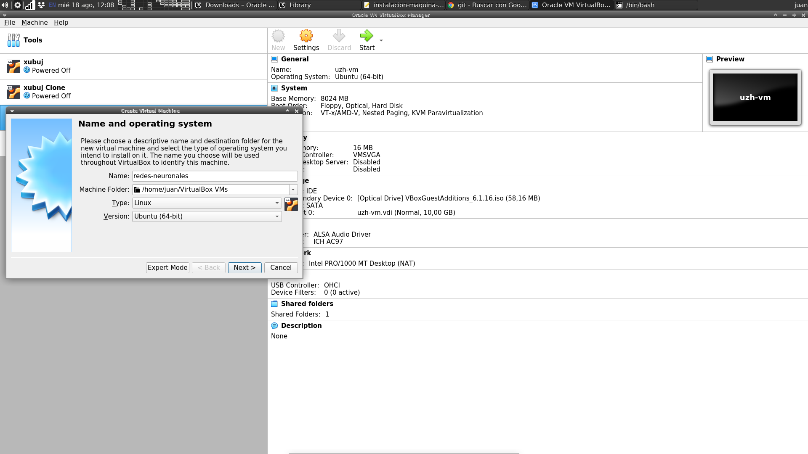
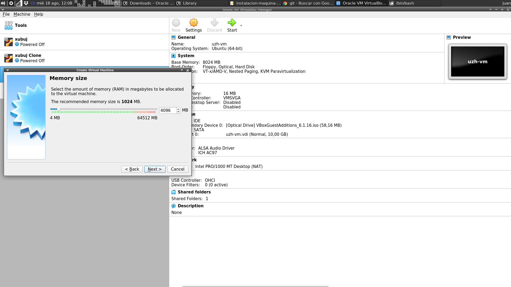
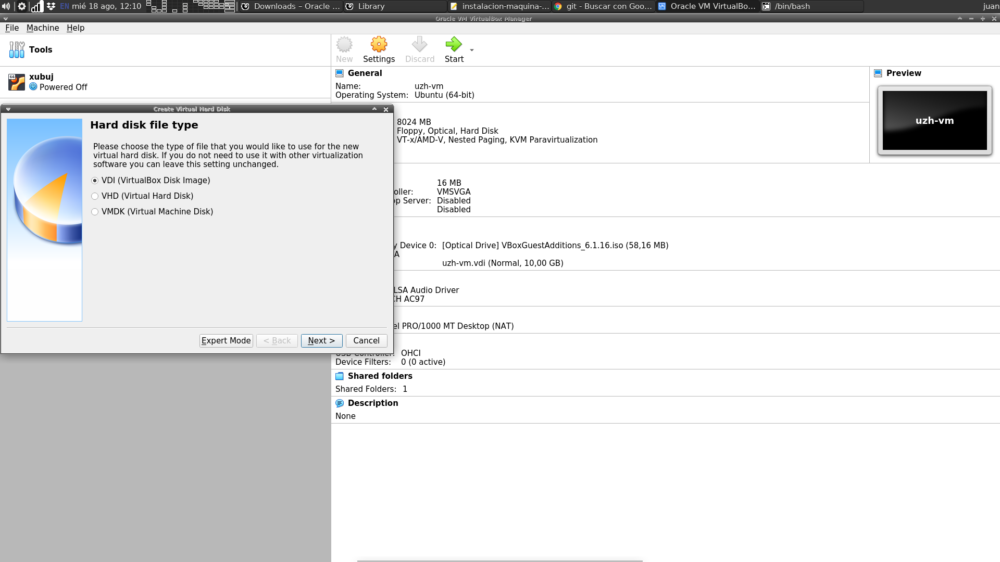
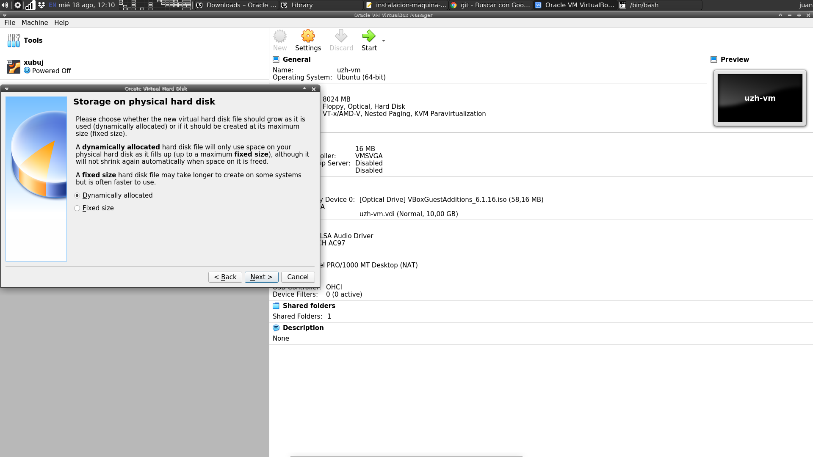
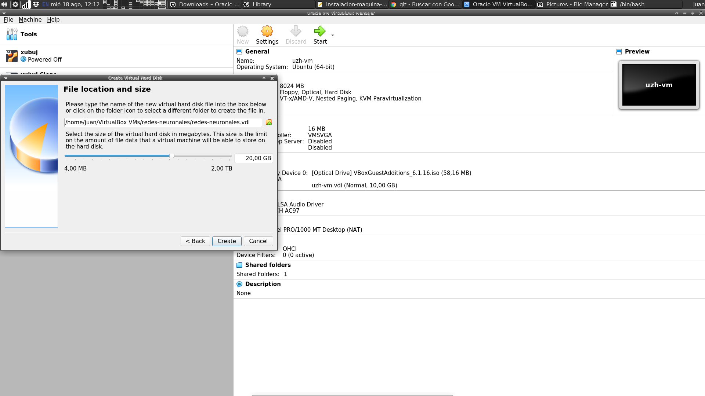

# Instalación de Máquina Virtual **Virtual Box**

Aquellos usuarios de **Windows** que deseen experimentar con **Linux**, podrán hacerlo utilizando una **máquina virtual** de **Virtual Box**.

**Virtual Box** es un administrador de máquinas virtuales que Ud. puede instalar en su **Sistema Operativo**, al cuál llamaremos **host** o **anfitrión**. Luego, con este administrador **Virtual Box**, ud. puede crear máquinas viruales e instalar en ellas los **Sistema Operativo** (SO) que desee. LLamaremos a cada uno de ellos, un **Sistema Operativo** **guest** o **invitado**. Luego podrá instalar en estos sistemas operativos **guest** los programas que desee. 

Para ello, aquí presentamos un tutorial para:

  1. instalar **Virtual Box**,
  2. crear una **maquina virtual** con **Virtual Box**, e
  3. instalar **Ubuntu** en la **maquina virtual**.
  
## Instalar **Virtual Box**

La receta es:

  1. Ir a [https://www.virtualbox.org/](https://www.virtualbox.org/)
  2. Descargar de [https://www.virtualbox.org/wiki/Downloads](https://www.virtualbox.org/wiki/Downloads) el instalador que corresponda a su sistema. Por ejemplo, si Ud. tiene **Windows**, el instalador para el mismo es [Windows hosts](https://download.virtualbox.org/virtualbox/6.1.26/VirtualBox-6.1.26-145957-Win.exe)

## Crear una **maquina virtual** con **Virtual Box**

  1. Inicial **Virtual Box**,
  2. Darle click al boton **New** (arriba centro).
  3. Aparece una ventana en donde hay que darle un nombre a la **máquina virtual** y elegir el tipo (ej. **Linux**) y la versión de **Sistema Operativo** **guest** (ej. **Ubuntu 64bit**),
      
  4. Luego darle a **Next**, aparece una nueva ventana en donde hay que elegir cuanta **memoria virtual** vamos a asignar a la **máquina virtual**. Les recomiendo 4GB o más. Recuerde no confundir MB (Mega Bytes) con GB (Giga Bytes), 1GB = 1000MB.
          
  5. Luego hay que crear un **disco virtual**. Simplemente clickee **Next**.
            
  6. Luego hay que especificar el tipo de disco virtual a utilizar. El recomendado está bien. Simplemente clickee **Next**.
      
  7. Luego hay que especificar si el **disco virtual** (el cuál será un gran archivo en su **Sistema Operativo** **host**) tendrá un tamaño dinámico o fijo. La opción dinámica es conveniente. Simplemente clickee **Next**.
        
  8. Luego hay que especificar el tamaño máximo del **disco virtual**. Sugiero 20GB.
      
     Luego, clickee **Crear** y la **máquina virtual** se creará.

## Instalar **Ubuntu** en la **maquina virtual**

