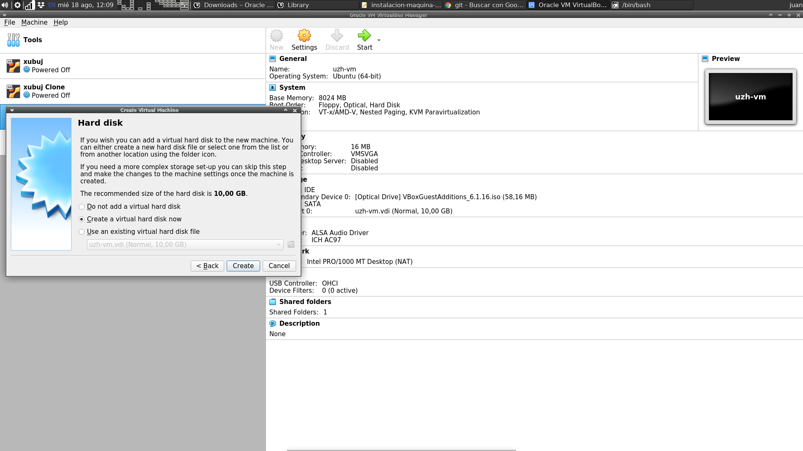
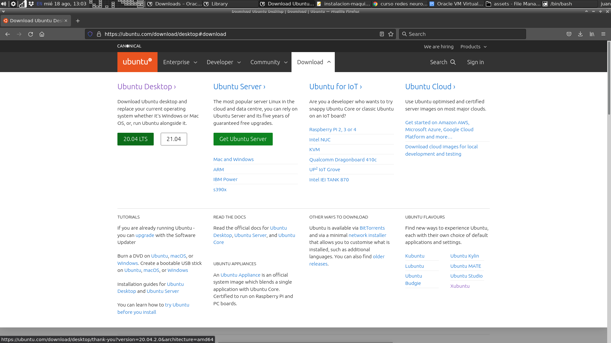
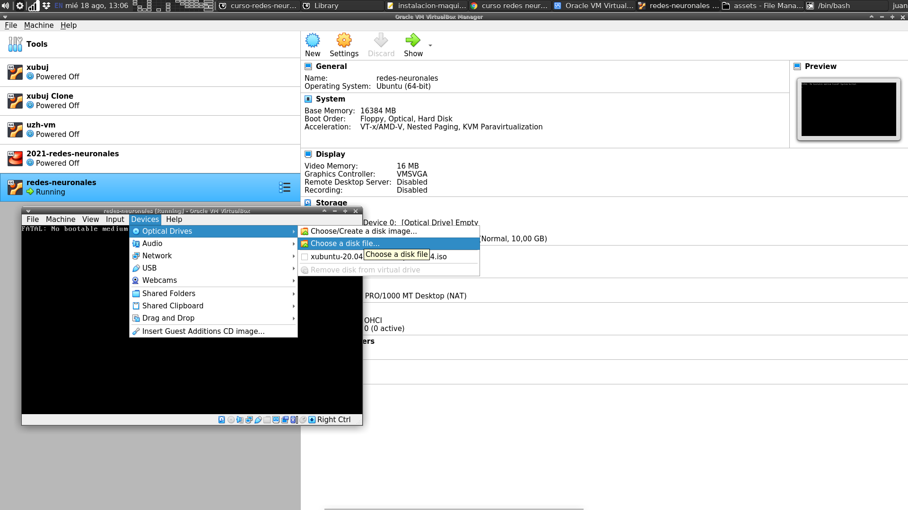
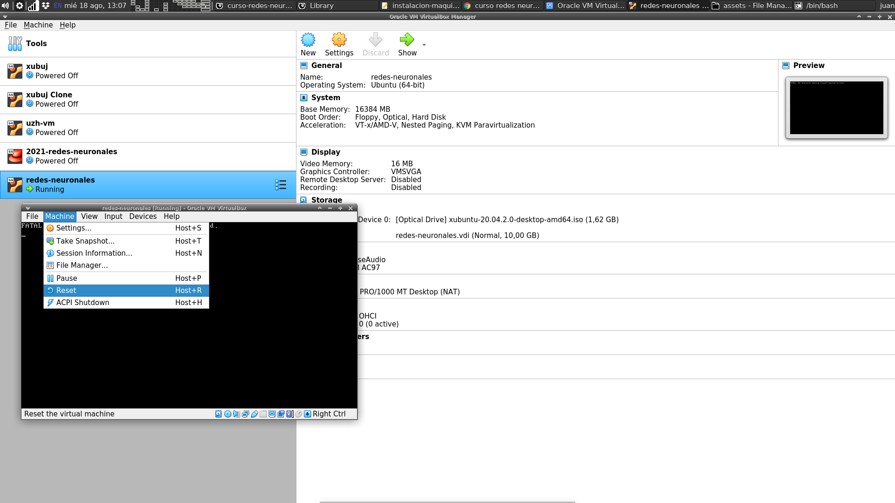
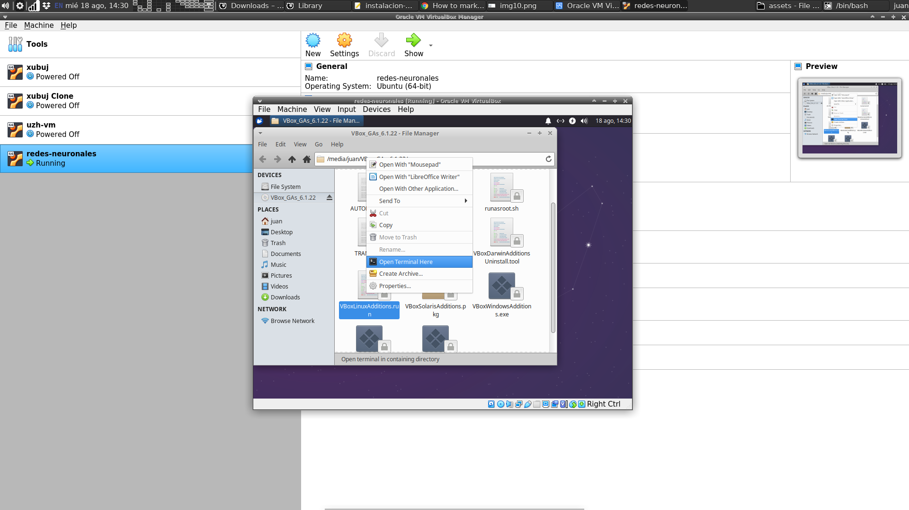
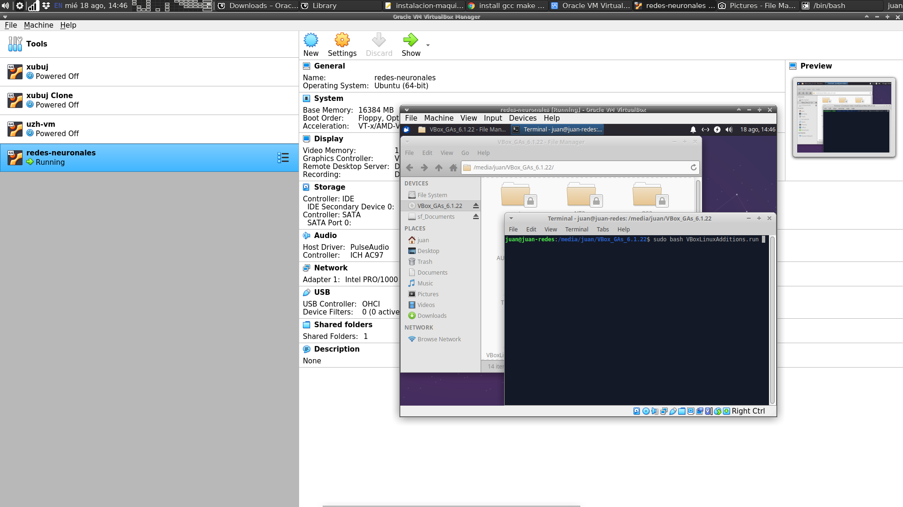
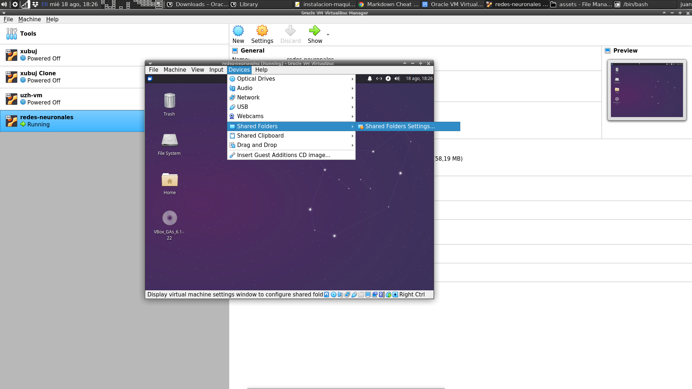
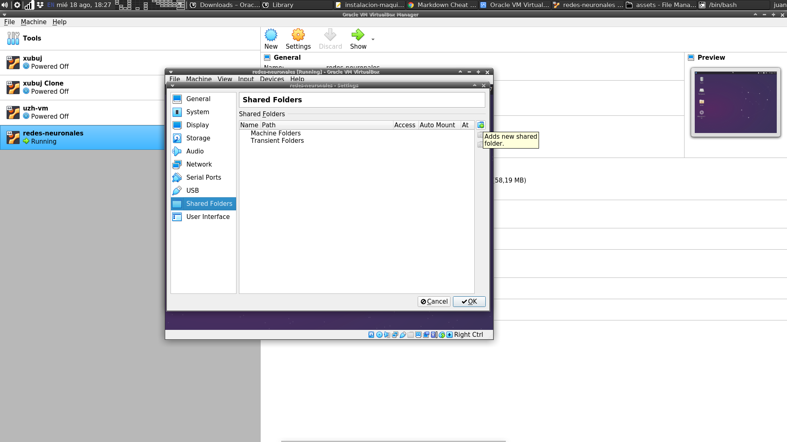
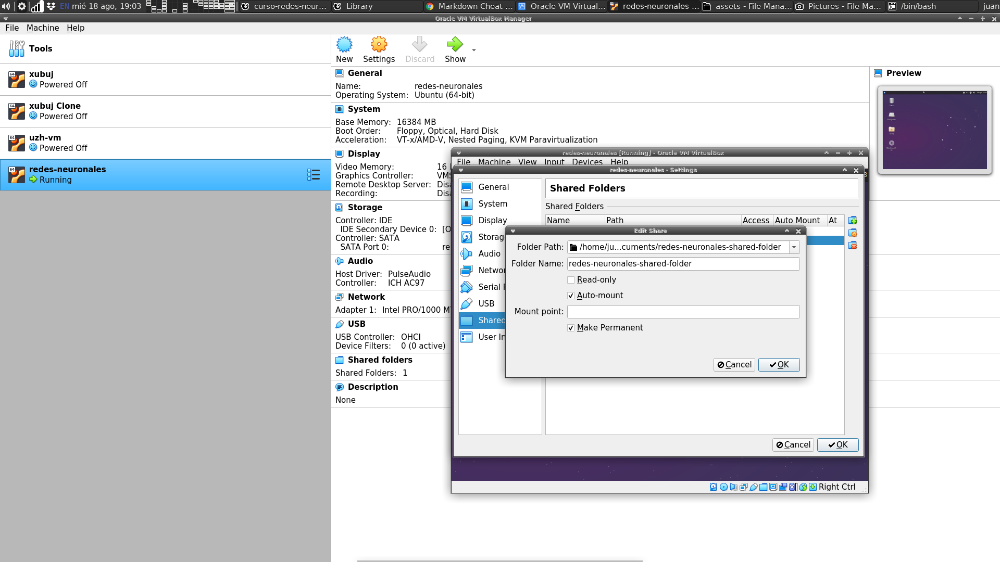
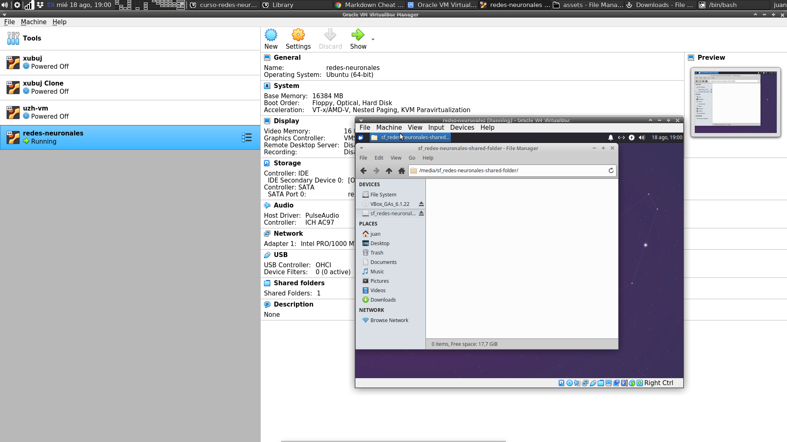

# Instalación de Máquina Virtual **Virtual Box**

Aquellos usuarios de **Windows** que deseen experimentar con **Linux**, podrán hacerlo utilizando una **máquina virtual** de **Virtual Box**.

**Virtual Box** es un administrador de máquinas virtuales que Ud. puede instalar en su **Sistema Operativo**, al cuál llamaremos **host** o **anfitrión**. Luego, con este administrador **Virtual Box**, ud. puede crear máquinas viruales e instalar en ellas los **Sistema Operativo** (SO) que desee. LLamaremos a cada uno de ellos, un **Sistema Operativo** **guest** o **invitado**. Luego podrá instalar en estos sistemas operativos **guest** los programas que desee. 

Para ello, aquí presentamos un tutorial para:

1. instalar **Virtual Box**,
2. crear una **maquina virtual** con **Virtual Box**, e
3. instalar **Ubuntu** en la **maquina virtual**.
  
## Instalar **Virtual Box**

La receta es:

1. Ir a [https://www.virtualbox.org/](https://www.virtualbox.org/)
2. Descargar de [https://www.virtualbox.org/wiki/Downloads](https://www.virtualbox.org/wiki/Downloads) el instalador que corresponda a su sistema. Por ejemplo, si Ud. tiene **Windows**, el instalador para el mismo es [Windows hosts](https://download.virtualbox.org/virtualbox/6.1.26/VirtualBox-6.1.26-145957-Win.exe)

## Crear una **maquina virtual** con **Virtual Box**

1. Inicial **Virtual Box**.
2. Darle click al boton **New** (arriba centro).
3. Aparece una ventana en donde hay que darle un nombre a la **máquina virtual** y elegir el tipo (ej. **Linux**) y la versión de **Sistema Operativo** **guest** (ej. **Ubuntu 64bit**),
      
4. Luego darle a **Next**, aparece una nueva ventana en donde hay que elegir cuanta **memoria virtual** vamos a asignar a la **máquina virtual**. Les recomiendo 4GB o más. Recuerde no confundir MB (Mega Bytes) con GB (Giga Bytes), 1GB = 1000MB.
          
5. Luego hay que crear un **disco virtual**. Simplemente clickee **Next**.
            
6. Luego hay que especificar el tipo de disco virtual a utilizar. El recomendado está bien. Simplemente clickee **Next**.
      
7. Luego hay que especificar si el **disco virtual** (el cuál será un gran archivo en su **Sistema Operativo** **host**) tendrá un tamaño dinámico o fijo. La opción dinámica es conveniente. Simplemente clickee **Next**.
        
8. Luego hay que especificar el tamaño máximo del **disco virtual**. Sugiero 20GB.
      
     Luego, clickee **Crear** y la **máquina virtual** se creará.

## Instalar **Ubuntu** en la **maquina virtual**

Las **Guest Additions** le permitira a su **Ubuntu** **guest** interactuar (intercambiar archivos, etc) con el **Sistema Operativo** **host** (ej. su **Windows**).

1. Bajar el archivo **.iso** (imagen del CD) de instalación de **Ubuntu**. Sugiero bajar la última versión **LTS** de **64bits**, actualmente la [20.04 LTS](https://ubuntu.com/download/desktop/thank-you?version=20.04.2.0&architecture=amd64). Alternativamente, si tu PC no es muy poderosa, sugiero la última **LTS** de **64bits** de **Xubuntu**, actualmente la [18.04](https://xubuntu.org/download), que se baja via **torrent**. Aún más liviano es **Lubuntu**, cuya última versión **LTS** de **64bits** es la **20.04** y se la puede bajar via **torrent** de aquí [https://lubuntu.me/downloads/](https://lubuntu.me/downloads/).
      
2. Inciar la **maquina virtual** recién creada eligiendola del menú y clickeando el boton **Start**. Esto inicializará la máquina, pero la misma dará error ya que no hemos insertado el archivo **.iso** o CD de instalación previamente descargado. Para insertarlo, ir al menú de la **máquina virtual**: *Devices -> Optical Drives -> Choose a disk file*, y elegir el archivo **.iso** previamente descargado. 
      
3. Luego hay que resetear la **máquina virtual** llendo al menu: *Machine -> Reset*.
        
4. La **máquina virtual** debería reiniciar ejecutando el proceso de instalación de **Ubuntu**.
        
     Proceder con la instalación. En algun momento puede que durante el proceso le aparezca un cartel preguntando si desea borrar el disco rígido. No se asuste, el disco que se borrará será el de la **máquina virtual** recientemente creada, y no el de su sistema operativo **host**. Si dicho cartel aparece, proceda. Al final, recomiendo desactivar el protector de pantalla del **Ubuntu** **guest** instalado.
5. Instalar **Guest Additions** en el **Ubuntu** **guest**. Para ello:

    5.1 Reinicie la **maquina virtual** de manera que inicie el **Ubuntu** instalado en ella. 
    
    5.2 Inserte el CD **Guest Additions**
      
            
    5.3 Esto deberia abrir una ventana con el **administrador de archivos** del **Ubuntu**. Elija el archivo `VBoxLinuxAdditions.run` con el boton derecho del mouse y abra una **terminal** allí
    
    5.4 Luego ejecute el instalador de **Guest Additions** ingresando, consecutivamente, las siguientes línea de comandos en la terminal:
    
      `$ sudo apt-get install build-essential gcc make perl dkms`

      `$ sudo bash VBoxLinuxAdditions.run`   

      
         
    Al hacer esto, el **Ubuntu** **guest** le preguntará su password de usario. Ingrésela para proceder. La primer línea de comando es necesaria para que el instalador de **Guest Additions** tenga accesso a **gcc**. La segunda instala las **Guest Additions**. Finalmente, resetee la **máquina virtual** para que la instalación tenga efecto.
    
6. Crear una **shared folder** entre el **Ubuntu Guest** y el **Sistema Operativo** **host**:

    6.1 Abrir una terminal y ejecutar las siguientes lineas de comando:
    
    `$ sudo adduser $USER vboxsf`
    
    `sudo usermod --append --groups vboxsf $USER`
    
    6.2 Luego crear una shared folder en el menú: *Devices -> Shared Folders -> Shared Folders Settings*.
    
    
    
    Esto abrirá un panel. A la derecha del mismo hay 3 íconos. El primero sirve para crear una shared folder. El segundo para editar una y el tercero para borrar una. Clikee el ícono para crear una.
    
    
    
    En el panel que se abre, setee *Auto-mount* y *Make Permanent*. Además, rellene el campo *Folder Path* con el directorio de su **Sistema Operativo** **host** que desea compartir. Finalmente, rellene el campo *Folder Name* con el nombre que uds. desea para el directorio compartido en su **Sistema Operativo** **guest**.
    
    
    
    Podrá encontrar la carpeta compartida abriendo el administrador de archivos. Aparecerá como un disco extraible.
    
        
