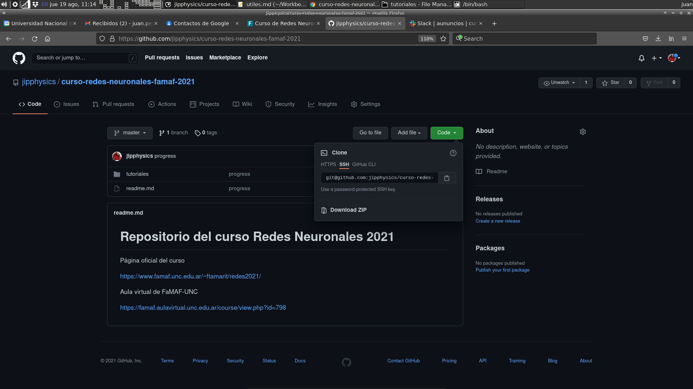
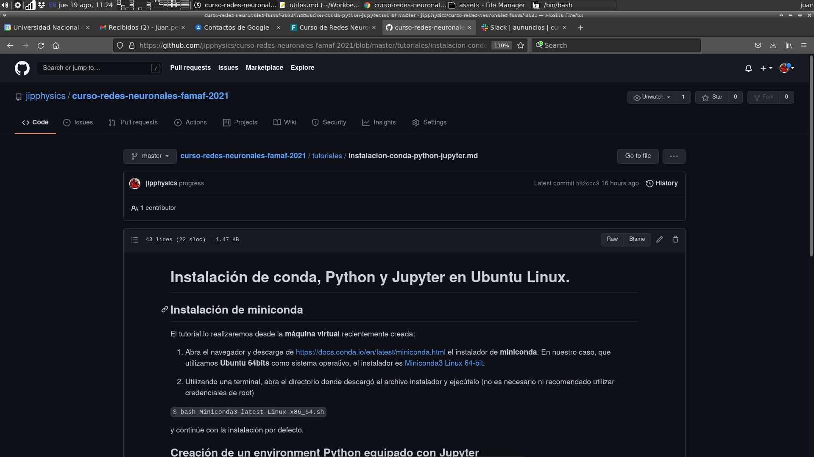
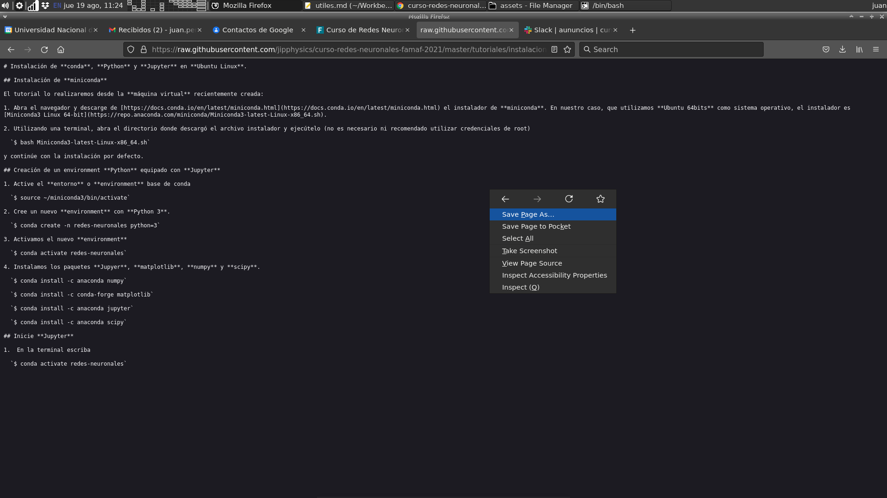

# Linux

  1. [Cheatsheet de comandos de Linux, en español](https://cheatography.com/jonathan992/cheat-sheets/gnu-linux-command-spanish/)

# GitHub  

Git es una herramienta muy útil, pero, aprender a usarlo puede requerir una inversión de tiempo y esfuerzo considerable. Es decir, no es algo que se pueda aprender a usar correctamente en 5 minutos y, si no se lo aprende a usar correctamente, se van a topar con problemas constantemente. A los interesados en aprender git, se los recomiendo! Pero, por favor, no se atrasen en la materia por aprender a usar git, ya que pueden bajar el material desde github sin necesidad de hacerlo tal como se explica abajo. 

En cualquier caso, para los interesados, recomiendo el siguiente tutorial de git en español [https://aulasoftwarelibre.github.io/taller-de-git/introduccion/](git https://aulasoftwarelibre.github.io/taller-de-git/introduccion/).

## Como bajar archivos de GitHub sin usar Git?

1. Si desea bajar todo el repositorio, vaya a la página principal del mismo, clickee el botón **Code** y econtrará un botón **Download ZIP**. Clickeelo y se bajará un archivo **.zip** con todo el contenido del repositorio.
  
   
  
2. Si desea bajar un archivo particular del repositorio. Navegue hasta el archivo deseado. 
  
    2.1 Si el archivo es de texto o similar, encontrará un botón que dice **Raw**. Clickeelo y el navegador web le mostrará el contenido textual del archivo, que ud. podrá bajarlo clickeando el boton derecho de su mouse, o utilizando la opción (**Guardar** o **Save**) correspondiente que ofrece el menú de su navegador. 
    
    

    
    
    2.2 Si el archivo no es de texto (ej. una imagen), entonces en vez de **Raw** existirá la opción **Download**. Clickeela para bajar el archivo.
    
    
